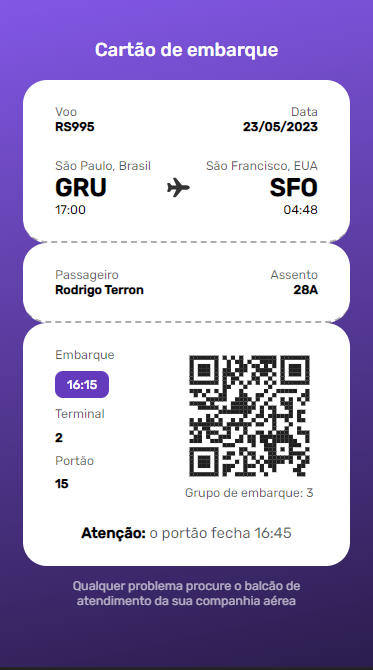

# Cartão de Embarque

## Descrição do Projeto

Um carão de embarque feito para o desafio #06 do #boraCodar da @Rocketseat.

<h1 align="center">
  
</h1>

### 🛠 Tecnologias

As seguintes ferramentas foram usadas na construção do projeto:

- [HTML](https://developer.mozilla.org/pt-BR/docs/Web/HTML)
- [CSS](https://developer.mozilla.org/pt-BR/docs/Web/CSS)

### Autor
---

Feito por Nathalia Azevedo 👋🏽 Entre em contato!

